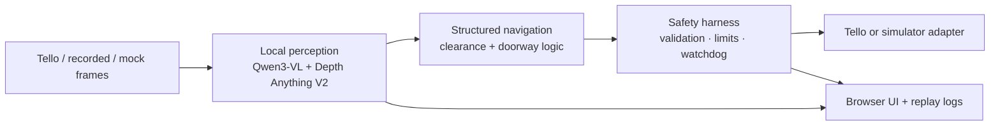

# BreachEye

**Local vision-language navigation for an indoor drone, with a separate flight-control safety layer.**

BreachEye explores how a small drone can interpret an unfamiliar room and turn visual observations into bounded movement. It combines Qwen3-VL navigation, Depth Anything V2 relative depth, a DJI Tello control harness, and a browser interface for inspecting the flight. Model inference runs on a local Apple Silicon Mac.

[Watch the demo](#demo) · [Try it locally](#try-it-locally) · [Architecture](#how-it-works) · [Documentation](docs/README.md)

## Demo

https://github.com/user-attachments/assets/36205d88-a732-44db-998c-558615afae3b

*14-second demo with original audio. Left: recorded Tello flight. Right: the actual frontend running a scripted camera, telemetry, and mapping simulation. The panels illustrate the intended interaction; they are not a synchronized inference replay.*

## The engineering problem

A visual model can describe a room, but flying through it requires explicit control boundaries. BreachEye keeps the model outside the hardware command path: observations become structured navigation decisions, which pass through validation, clearance checks, and a controller that limits motion duration and velocity.

The project focuses on three practical concerns:

- **Local perception:** keep depth inference and keyframe navigation on the companion computer, with model health and fallback behavior visible to the rest of the system.
- **Bounded actions:** make movement short-lived and observable; preserve watchdog and operator control independently of model inference.
- **Replayable decisions:** save source frames, depth outputs, navigation context, and command results so a failed maneuver can be traced across the pipeline.

## How it works



The harness owns the drone connection. Perception runs in a separate process over ZMQ, so model latency and failures do not own the command channel. The React/Three.js frontend consumes telemetry and displays camera, POI, and reconstruction views.

Doorway centering and transit logic feed a room graph. This is an experimental spatial memory path; it is not a validated SLAM system. Depth is normalized **relative depth**, not calibrated distance in meters.

Read the [architecture](docs/architecture.md), [pipeline contract](docs/rafa-vlm-pipeline.md), and [control boundary](docs/llm-control-boundary.md) for the implementation decisions.

## Measured locally

Recorded component benchmarks on Apple Silicon, May 2026:

| Component | Recorded result | Scope |
| --- | --- | --- |
| Depth Anything V2 Small | **40.6 ms / frame ≈ 24.6 FPS** | MPS depth inference; not end-to-end flight throughput |
| Qwen3-VL-2B | **1.25 s mean response** | Warm local server, 48-token cap, five cache-busted runs after warmup |

The [benchmark notes](docs/rafa-benchmark-results.md) describe the setup and candidate-model tradeoffs. The [Qwen run artifact](demo/benchmarks/qwen3-vl-2b-server-cachebust-48tokens-nomarkdown.json) includes timings and outputs. These are recorded measurements, not a navigation-quality or autonomous-flight success benchmark.

## Try it locally

### Browser demo — no drone or model weights

Requires Node.js 22+ and npm.

```bash
git clone https://github.com/rafcis0/breacheye.git
cd breacheye/frontend
npm ci
npm run dev
```

Open **[localhost:5173/?demo=1](http://localhost:5173/?demo=1)**. The scene rises, traverses toward the bed, and approaches the wall. Telemetry and the map marker follow the same scripted motion. Demo controls never send hardware commands.

### Python simulator — exercise the control pipeline

From the repository root, with Python 3.11+:

```bash
python3 -m venv .venv
source .venv/bin/activate
pip install -e ".[test,rafa]"
breacheye fly --mode sim --rafa-mode stub --duration-s 10
```

This runs the simulator with stub perception and writes local logs. If port 8000 is occupied, add `--port 18080`. For real model setup, start with the [pipeline guide](docs/rafa-vlm-pipeline.md). For an actual Tello, follow the [hardware runbook](docs/hardware-runbook.md); the browser demo is independent of that path.

## Project status

**Implemented:** simulator and Tello adapters, structured command validation, motion limits and watchdogs, local model adapters with fallbacks, optical-flow stabilization tooling, doorway logic, room-graph updates, and offline decision reports.

**Demonstrated separately:** recorded hardware flight, local component inference benchmarks, and an interactive frontend simulation.

**Still experimental:** robust autonomous multi-room flight, navigation quality across unseen rooms, metric reconstruction, and live SLAM integration. Hardware footage and unit tests do not establish those capabilities.

## Development

```bash
# From the repository root, with the Python environment above active
pytest -q

# Frontend checks
cd frontend
npm test
npm run build
```

The Python suite uses simulator, mock, and in-process messaging tests; no hardware or model weights are required. CI runs the Python suite and frontend tests/build. [Demo capture instructions](demo/README.md) explain how to regenerate the side-by-side video and run its browser checks.

| Area | Purpose |
| --- | --- |
| [`src/breacheye/`](src/breacheye/) | Runtime, model adapters, navigation, safety harness, and CLI |
| [`frontend/`](frontend/) | React/Three.js operator interface and isolated demo mode |
| [`ai/`](ai/) | Model benchmarks and reconstruction experiments |
| [`integration/`](integration/) | Frame ingestion and external-system integration |
| [`tests/`](tests/) | Behavioral checks using simulator and mock inputs |
| [`docs/`](docs/README.md) | Technical guides, evidence, and historical design notes |

## Background

Built by **Rafael Cisneros and Cooper** during the May 2026 NatSec hackathon, with subsequent work on flight diagnostics and the demonstration interface. Rafael's track focused on AI/ML, model evaluation, perception, and navigation; Cooper's track focused on drone integration, the frontend, and external-system integration.

The original [interface agreement](CONSTITUTION.md) and [hackathon workplan](WORKPLAN.md) remain available as project history.
